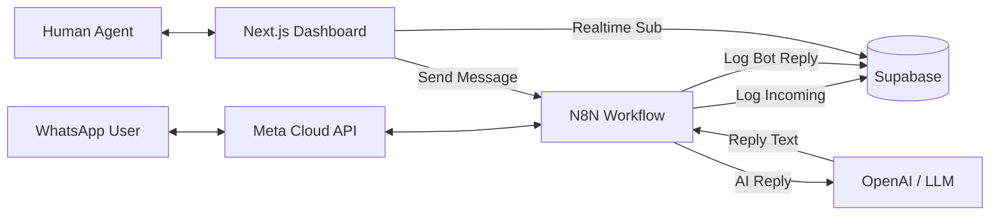

# Product Specification: AI-Powered WhatsApp Inbox

**Version**: 1.0  
**Date**: January 12, 2026  
**Status**: Production Ready  

---

## 1. Executive Summary
This project delivers a **Hybrid Customer Support System** that integrates WhatsApp with an AI Agent (via N8N) and a Human Agent Dashboard (Next.js). The core value proposition is the seamless **"Human-in-the-loop"** capability, allowing AI to handle routine queries while enabling human agents to intervene instantly when complex situations arise, without disrupting the user experience.

## 2. System Architecture

The system utilizes an **Event-Driven Architecture** orchestrated by N8N.

### Data Flow
1.  **Inbound**: User messages -> N8N -> API (`/incoming`) -> Database.
2.  **Routing**: N8N checks Status (`/check-status`). If `bot`, AI replies. If `human`, AI stops.
3.  **Bot Reply**: AI Generates Text -> N8N sends to User -> N8N logs to API (`/bot`).
4.  **Human Reply**: Agent types in Dashboard -> API (`/send`) -> N8N Webhook -> User.

---

## 3. Technology Stack

### Frontend Application
*   **Framework**: Next.js 14 (App Router)
*   **UI Library**: TailwindCSS + Lucide React Icons
*   **State Management**: React Hooks + Supabase Realtime
*   **Theme**: Optimized Dark Mode (WhatsApp aesthetic)

### Backend & Database
*   **API Layer**: Next.js Serverless Functions (Route Handlers)
*   **Database**: Supabase (PostgreSQL)
*   **Realtime**: Supabase Realtime (WebSockets for live updates)
*   **Authentication**: Configured for Supabase Auth (Disabled for MVP/Testing)

### Orchestration & AI
*   **Workflow Engine**: N8N
*   **LLM Provider**: OpenAI (via N8N LangChain nodes)
*   **Messaging Provider**: WhatsApp Business API (Meta)

---

## 4. Key Features & Functional Requirements

### 4.1 Unified Inbox
*   **Requirement**: Display all active conversations in a list.
*   **Feature**: Real-time sorting by newest message.
*   **Indicators**: Unread count badges (Green), Status indicators (Human/Bot).
*   **Filters**: Tabs for "All", "Unread", "Human", "Bot".

### 4.2 Chat Interface
*   **Requirement**: Mimic native WhatsApp Web experience.
*   **Feature**: Bubble layout (Left: User, Right: Agent/Bot).
*   **Context**: Distinction between "Bot" sent messages and "You" (Human) sent messages.
*   **Read Receipts**: Double-check ticks for outgoing messages.

### 4.3 Human Handoff (The "Take Over" Protocol)
*   **Requirement**: Prevent AI from hallucinating or interrupting when a human is working.
*   **Implementation**:
    *   **Bot Mode**: Input box is **HIDDEN**. "Take Over" button is visible.
    *   **Human Mode**: Input box is **VISIBLE**. "Return to Bot" button is visible.
    *   **Logic**: Toggling status updates the database `status` field, which N8N checks before every AI reply.

### 4.4 Real-time Updates
*   **Requirement**: No manual page refreshes.
*   **Implementation**: Incoming messages appear instantly via WebSocket subscriptions. Unread counts update dynamically.

---

## 5. API Specification

The Next.js application exposes 4 critical endpoints for N8N integration.

### 5.1 Incoming Message Hook
*   **Endpoint**: `POST /api/whatsapp/incoming`
*   **Purpose**: Logs user message, creates conversation if new, increments unread count.
*   **Returns**: `{ success: true, status: 'bot'|'human' }` (Used by N8N to decide if it should trigger AI).

### 5.2 Bot Logging Hook
*   **Endpoint**: `POST /api/whatsapp/bot`
*   **Purpose**: Logs messages generated by the AI so they appear in the dashboard.
*   **Payload**: `{ phone: string, message: string }`

### 5.3 Human Reply Hook
*   **Endpoint**: `POST /api/whatsapp/send`
*   **Purpose**: Triggered by Dashboard. Logs message as 'human' and calls N8N webhook to deliver to WhatsApp.
*   **Payload**: `{ conversation_id: uuid, message: string }`

### 5.4 Status Check
*   **Endpoint**: `POST /api/whatsapp/check-status`
*   **Purpose**: Stateless check for N8N workflows (e.g., scheduled follow-ups) to verify if they are allowed to message the user.
*   **Payload**: `{ phone: string }`

---

## 6. Data Model

### Table: `conversations`
| Column | Type | Description |
| :--- | :--- | :--- |
| `id` | UUID | Primary Key |
| `phone` | Text | Unique User Phone Number |
| `name` | Text | User Profile Name |
| `status` | Text | `bot` or `human`. Controls automation flow. |
| `unread_count` | Int | Number of unseen user messages. |
| `last_message` | Text | Preview text for inbox list. |
| `updated_at` | TS | Timestamp for sorting. |

### Table: `messages`
| Column | Type | Description |
| :--- | :--- | :--- |
| `id` | UUID | Primary Key |
| `conversation_id` | UUID | FK to `conversations` |
| `sender` | Text | `user`, `bot`, or `human` |
| `message` | Text | The message content |
| `is_read` | Bool | Read receipt status |
| `created_at` | TS | Timestamp |

---

## 7. Future Roadmap (v2.0)
1.  **Media Support**: Ability to send/receive images and documents.
2.  **Authentication**: Enable Supabase Auth for multi-agent login.
3.  **Template Messages**: Support for WhatsApp Template messages (Marketing/Utility) from Dashboard.
4.  **Analytics**: Dashboard for Response Time, Bot vs Human resolution rate.
